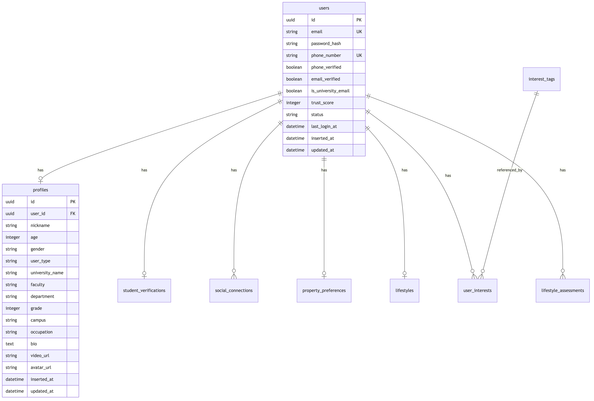
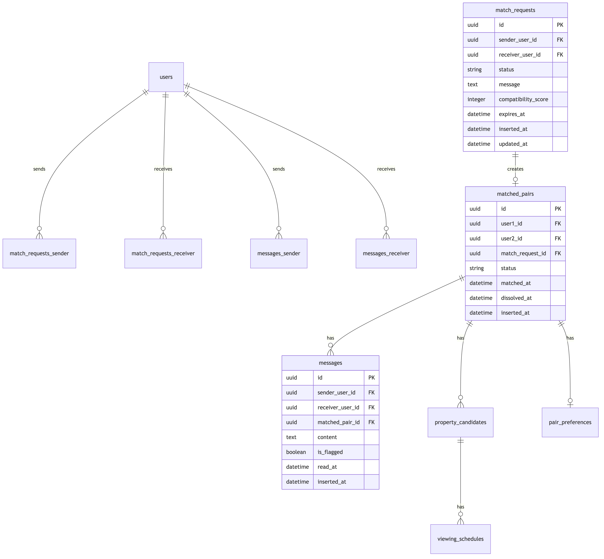

# データベース設計書

## ER図

### コア機能（ユーザー・プロフィール・認証）

### マッチング機能

### コミュニティ・レビュー機能

詳細は以下のテーブル定義を参照してください。

## テーブル一覧

### 1. ユーザー管理（4テーブル）

#### users - ユーザー基本情報
| カラム名 | 型 | 説明 |
|---------|-----|------|
| id | UUID | プライマリーキー |
| email | STRING | メールアドレス（ユニーク） |
| password_hash | STRING | パスワードハッシュ |
| phone_number | STRING | 電話番号（ユニーク） |
| phone_verified | BOOLEAN | 電話番号認証済み |
| email_verified | BOOLEAN | メール認証済み |
| is_university_email | BOOLEAN | 大学メールアドレスか |
| trust_score | INTEGER | 信頼スコア (0-100) |
| status | STRING | ステータス (active等) |
| last_login_at | DATETIME | 最終ログイン日時 |

#### profiles - プロフィール
| カラム名 | 型 | 説明 |
|---------|-----|------|
| id | UUID | プライマリーキー |
| user_id | UUID | users.id への外部キー |
| nickname | STRING | ニックネーム |
| age | INTEGER | 年齢 |
| gender | STRING | 性別 |
| user_type | STRING | ユーザータイプ (student, working等) |
| university_name | STRING | 大学名 |
| faculty | STRING | 学部 |
| department | STRING | 学科 |
| grade | INTEGER | 学年 |
| campus | STRING | キャンパス |
| occupation | STRING | 職業 |
| bio | TEXT | 自己紹介 |
| video_url | STRING | 自己紹介動画URL |
| avatar_url | STRING | アバター画像URL |

#### student_verifications - 学生証認証
| カラム名 | 型 | 説明 |
|---------|-----|------|
| id | UUID | プライマリーキー |
| user_id | UUID | users.id への外部キー |
| student_card_image_url | STRING | 学生証画像URL |
| university_name | STRING | 大学名 |
| status | STRING | ステータス (pending, approved, rejected) |
| verified_at | DATETIME | 認証日時 |

#### social_connections - SNS連携
| カラム名 | 型 | 説明 |
|---------|-----|------|
| id | UUID | プライマリーキー |
| user_id | UUID | users.id への外部キー |
| provider | STRING | SNSプロバイダー (google, twitter, instagram) |
| provider_user_id | STRING | プロバイダー側のユーザーID |

---

### 2. 希望条件・ライフスタイル（5テーブル）

#### property_preferences - 物件希望条件
| カラム名 | 型 | 説明 |
|---------|-----|------|
| id | UUID | プライマリーキー |
| user_id | UUID | users.id への外部キー |
| min_rent | DECIMAL | 最低家賃 |
| max_rent | DECIMAL | 最高家賃 |
| max_initial_cost | DECIMAL | 初期費用上限 |
| preferred_prefectures | ARRAY | 希望都道府県 |
| preferred_cities | ARRAY | 希望市区町村 |
| preferred_stations | ARRAY | 希望最寄り駅 |
| max_commute_time | INTEGER | 最大通勤時間（分） |
| room_types | ARRAY | 希望間取り (1LDK, 2DK等) |
| min_building_age | INTEGER | 最低築年数 |
| max_building_age | INTEGER | 最高築年数 |
| requires_auto_lock | BOOLEAN | オートロック必須 |
| requires_separate_bath_toilet | BOOLEAN | バストイレ別必須 |
| requires_south_facing | BOOLEAN | 南向き必須 |
| other_requirements | TEXT | その他要件 |
| move_in_timing | STRING | 入居時期 (immediate, 1-3months等) |

#### lifestyles - ライフスタイル
| カラム名 | 型 | 説明 |
|---------|-----|------|
| id | UUID | プライマリーキー |
| user_id | UUID | users.id への外部キー |
| sleep_schedule | STRING | 睡眠スケジュール (early_bird, night_owl等) |
| cleanliness_level | INTEGER | 清潔度レベル (1-5) |
| smoking | BOOLEAN | 喫煙 |
| e_cigarette | BOOLEAN | 電子タバコ |
| pets | STRING | ペット (have, want, allergic, neutral) |
| guest_frequency | STRING | 来客頻度 (rarely, monthly, weekly) |
| noise_tolerance | INTEGER | 騒音許容度 (1-5) |
| socializing_preference | INTEGER | 社交性 (1-5) |
| home_time | STRING | 在宅時間 (mostly_out, half, mostly_home) |
| cooking_frequency | STRING | 料理頻度 (never, sometimes, daily) |

#### interest_tags - 興味・趣味タグ
| カラム名 | 型 | 説明 |
|---------|-----|------|
| id | UUID | プライマリーキー |
| name | STRING | タグ名（ユニーク） |
| category | STRING | カテゴリー |

#### user_interests - ユーザーと興味の関連
| カラム名 | 型 | 説明 |
|---------|-----|------|
| user_id | UUID | users.id への外部キー |
| interest_tag_id | UUID | interest_tags.id への外部キー |

#### lifestyle_assessments - ライフスタイル診断結果
| カラム名 | 型 | 説明 |
|---------|-----|------|
| id | UUID | プライマリーキー |
| user_id | UUID | users.id への外部キー |
| question_id | INTEGER | 質問ID |
| answer_value | INTEGER | 回答値 |
| completed_at | DATETIME | 完了日時 |

---

### 3. マッチング機能（6テーブル）

#### match_requests - マッチングリクエスト
| カラム名 | 型 | 説明 |
|---------|-----|------|
| id | UUID | プライマリーキー |
| sender_user_id | UUID | 送信者 users.id |
| receiver_user_id | UUID | 受信者 users.id |
| status | STRING | ステータス (pending, accepted, rejected, expired) |
| message | TEXT | メッセージ |
| compatibility_score | INTEGER | 相性スコア (0-100) |
| expires_at | DATETIME | 期限 |

#### matched_pairs - マッチング成立ペア
| カラム名 | 型 | 説明 |
|---------|-----|------|
| id | UUID | プライマリーキー |
| user1_id | UUID | ユーザー1 (user1_id < user2_id) |
| user2_id | UUID | ユーザー2 |
| match_request_id | UUID | match_requests.id への外部キー |
| status | STRING | ステータス (active, property_searching, contracted, dissolved) |
| matched_at | DATETIME | マッチング日時 |
| dissolved_at | DATETIME | 解消日時 |

#### messages - メッセージ
| カラム名 | 型 | 説明 |
|---------|-----|------|
| id | UUID | プライマリーキー |
| sender_user_id | UUID | 送信者 users.id |
| receiver_user_id | UUID | 受信者 users.id |
| matched_pair_id | UUID | matched_pairs.id への外部キー |
| content | TEXT | メッセージ内容 |
| is_flagged | BOOLEAN | フラグ付き |
| read_at | DATETIME | 既読日時 |

#### property_candidates - 物件候補
| カラム名 | 型 | 説明 |
|---------|-----|------|
| id | UUID | プライマリーキー |
| matched_pair_id | UUID | matched_pairs.id への外部キー |
| source_url | STRING | 元URL (SUUMO等) |
| title | STRING | 物件タイトル |
| address | TEXT | 住所 |
| rent | DECIMAL | 家賃 |
| initial_cost | DECIMAL | 初期費用 |
| room_type | STRING | 間取り |
| building_age | INTEGER | 築年数 |
| station_name | STRING | 最寄り駅 |
| station_walk_minutes | INTEGER | 駅徒歩分 |
| image_urls | ARRAY | 画像URL配列 |
| description | TEXT | 説明 |
| user1_rating | INTEGER | ユーザー1評価 (1-5) |
| user2_rating | INTEGER | ユーザー2評価 (1-5) |
| user1_comment | TEXT | ユーザー1コメント |
| user2_comment | TEXT | ユーザー2コメント |
| status | STRING | ステータス (candidate, favorite, viewing_scheduled等) |

#### pair_preferences - ペアの共通希望条件
| カラム名 | 型 | 説明 |
|---------|-----|------|
| id | UUID | プライマリーキー |
| matched_pair_id | UUID | matched_pairs.id への外部キー |
| agreed_min_rent | DECIMAL | 合意済み最低家賃 |
| agreed_max_rent | DECIMAL | 合意済み最高家賃 |
| agreed_max_initial_cost | DECIMAL | 合意済み初期費用上限 |
| agreed_areas | ARRAY | 合意済みエリア |
| agreed_stations | ARRAY | 合意済み駅 |
| agreed_room_types | ARRAY | 合意済み間取り |
| priority_order | ARRAY | 優先順位 |

#### viewing_schedules - 内見スケジュール
| カラム名 | 型 | 説明 |
|---------|-----|------|
| id | UUID | プライマリーキー |
| property_candidate_id | UUID | property_candidates.id への外部キー |
| scheduled_date | DATETIME | 予定日時 |
| location | TEXT | 場所 |
| notes | TEXT | メモ |
| status | STRING | ステータス (scheduled, completed, cancelled) |

---

### 4. コミュニティ機能（7テーブル）

#### reviews - レビュー・評価
| カラム名 | 型 | 説明 |
|---------|-----|------|
| id | UUID | プライマリーキー |
| reviewer_user_id | UUID | レビュー投稿者 users.id |
| reviewee_user_id | UUID | レビュー対象者 users.id |
| matched_pair_id | UUID | matched_pairs.id への外部キー |
| cleanliness_rating | INTEGER | 清潔度評価 (1-5) |
| communication_rating | INTEGER | コミュニケーション評価 (1-5) |
| rule_compliance_rating | INTEGER | ルール遵守評価 (1-5) |
| financial_reliability_rating | INTEGER | 金銭面信頼性評価 (1-5) |
| overall_rating | INTEGER | 総合評価 (1-5) |
| positive_comment | TEXT | 良かった点 |
| improvement_comment | TEXT | 改善点 |
| advice_for_next | TEXT | 次の人へのアドバイス |
| visibility | STRING | 公開範囲 (public等) |

#### reports - 通報
| カラム名 | 型 | 説明 |
|---------|-----|------|
| id | UUID | プライマリーキー |
| reporter_user_id | UUID | 通報者 users.id |
| reported_user_id | UUID | 通報対象者 users.id |
| reason | STRING | 理由 |
| description | TEXT | 詳細 |
| status | STRING | ステータス (pending等) |
| resolved_at | DATETIME | 解決日時 |

#### blocked_users - ブロックリスト
| カラム名 | 型 | 説明 |
|---------|-----|------|
| blocker_user_id | UUID | ブロック実行者 users.id |
| blocked_user_id | UUID | ブロック対象者 users.id |
| blocked_at | DATETIME | ブロック日時 |

#### favorite_users - お気に入りユーザー
| カラム名 | 型 | 説明 |
|---------|-----|------|
| user_id | UUID | users.id |
| favorite_user_id | UUID | お気に入りユーザー users.id |

#### view_history - 閲覧履歴
| カラム名 | 型 | 説明 |
|---------|-----|------|
| id | UUID | プライマリーキー |
| user_id | UUID | 閲覧者 users.id |
| viewed_user_id | UUID | 閲覧されたユーザー users.id |
| viewed_at | DATETIME | 閲覧日時 |

#### notifications - 通知
| カラム名 | 型 | 説明 |
|---------|-----|------|
| id | UUID | プライマリーキー |
| user_id | UUID | users.id への外部キー |
| type | STRING | 通知タイプ |
| title | STRING | タイトル |
| content | TEXT | 内容 |
| link_url | STRING | リンクURL |
| is_read | BOOLEAN | 既読フラグ |
| read_at | DATETIME | 既読日時 |

#### university_posts - 大学コミュニティ投稿
| カラム名 | 型 | 説明 |
|---------|-----|------|
| id | UUID | プライマリーキー |
| user_id | UUID | users.id への外部キー |
| university_name | STRING | 大学名 |
| title | STRING | タイトル |
| content | TEXT | 内容 |
| category | STRING | カテゴリー (question, advice, property_info, event) |

#### university_post_comments - 投稿コメント
| カラム名 | 型 | 説明 |
|---------|-----|------|
| id | UUID | プライマリーキー |
| post_id | UUID | university_posts.id への外部キー |
| user_id | UUID | users.id への外部キー |
| content | TEXT | コメント内容 |

---

## 主要な設計方針

### 1. ルームメイトファースト
- 物件テーブルは存在せず、**ユーザー間のマッチングが中心**
- 物件は `property_candidates`（候補）として、マッチング後に2人で共有

### 2. セキュリティ
- **UUID**をプライマリーキーとして使用（推測困難）
- パスワードは**ハッシュ化**して保存
- 信頼スコアシステムで安全性を担保

### 3. データ整合性
- **外部キー制約**で関連データの整合性を保証
- **Check制約**で評価値の範囲を検証（1-5、0-100等）
- **Unique制約**で重複を防止

### 4. パフォーマンス
- 頻繁に検索されるカラムに**インデックス**を設定
- PostgreSQLの**配列型**を活用（preferred_cities等）

### 5. 拡張性
- **enum型ではなくstring型**を使用（柔軟性重視）
- タイムスタンプで履歴管理
- ソフトデリート可能な設計

---

**合計: 22テーブル**

作成日: 2025年12月8日
