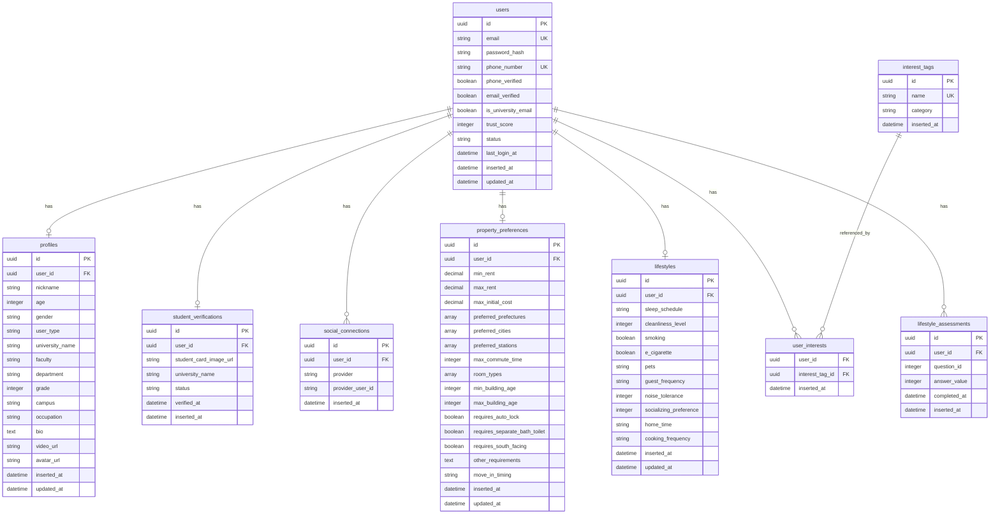
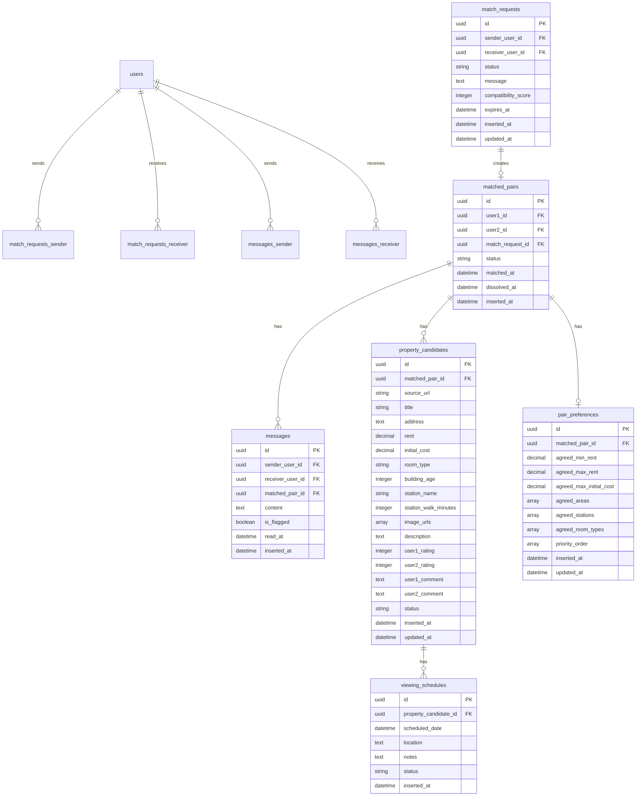
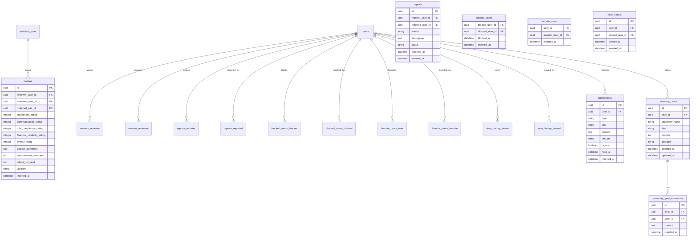

# データベース設計書

## ER図

### コア機能（ユーザー・プロフィール・認証）

### マッチング機能

### コミュニティ・レビュー機能

## テーブル一覧

### 1. ユーザー管理（4テーブル）
- **users**: ユーザー基本情報・認証
- **profiles**: プロフィール詳細
- **student_verifications**: 学生証認証
- **social_connections**: SNS連携

### 2. 希望条件・ライフスタイル（5テーブル）
- **property_preferences**: 物件希望条件
- **lifestyles**: ライフスタイル情報
- **interest_tags**: 興味・趣味タグ
- **user_interests**: ユーザーと興味タグの関連
- **lifestyle_assessments**: ライフスタイル診断結果

### 3. マッチング機能（6テーブル）
- **match_requests**: マッチングリクエスト
- **matched_pairs**: マッチング成立ペア
- **messages**: メッセージ
- **property_candidates**: 物件候補リスト
- **pair_preferences**: ペアの共通希望条件
- **viewing_schedules**: 内見スケジュール

### 4. コミュニティ機能（7テーブル）
- **reviews**: レビュー・評価
- **reports**: 通報
- **blocked_users**: ブロックリスト
- **favorite_users**: お気に入りユーザー
- **view_history**: 閲覧履歴
- **notifications**: 通知
- **university_posts**: 大学コミュニティ投稿
- **university_post_comments**: 投稿へのコメント

**合計: 22テーブル**

## 主要な設計方針

### 1. ルームメイトファースト
- 物件テーブルは存在せず、**ユーザー間のマッチングが中心**
- 物件は `property_candidates`（候補）として、マッチング後に2人で共有

### 2. セキュリティ
- **UUID**をプライマリーキーとして使用（推測困難）
- パスワードは**ハッシュ化**して保存
- 信頼スコアシステムで安全性を担保

### 3. データ整合性
- **外部キー制約**で関連データの整合性を保証
- **Check制約**で評価値の範囲を検証（1-5、0-100等）
- **Unique制約**で重複を防止

### 4. パフォーマンス
- 頻繁に検索されるカラムに**インデックス**を設定
- PostgreSQLの**配列型**を活用（preferred_cities等）

### 5. 拡張性
- **enum型ではなくstring型**を使用（柔軟性重視）
- タイムスタンプで履歴管理
- ソフトデリート可能な設計

## 次のステップ

1. ✅ マイグレーション作成完了
2. ⏳ Ectoスキーマモジュールの作成
3. ⏳ Changesetによるバリデーション実装
4. ⏳ Context層のビジネスロジック実装
5. ⏳ API実装
